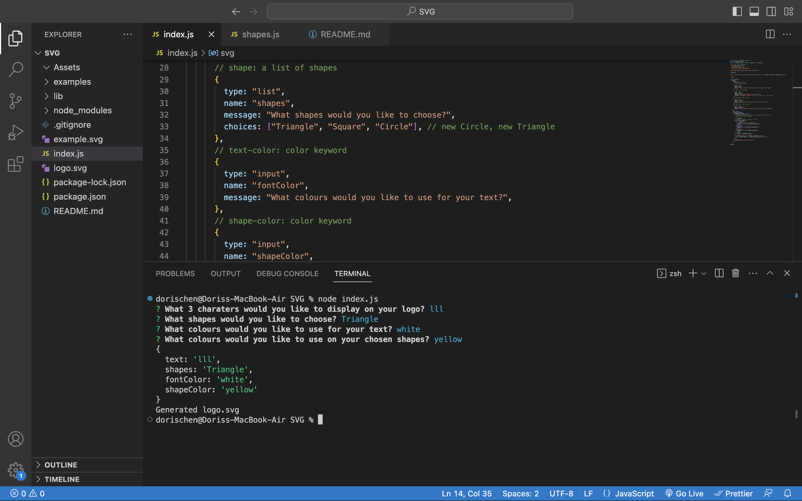
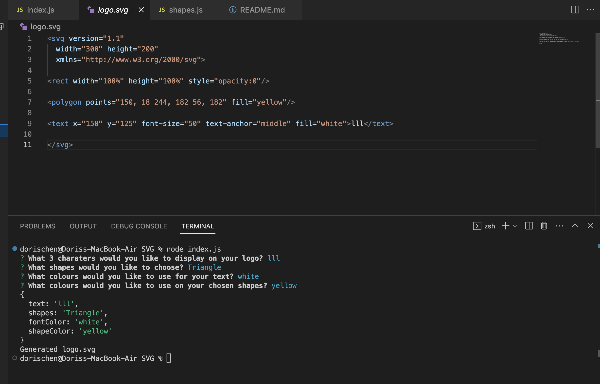
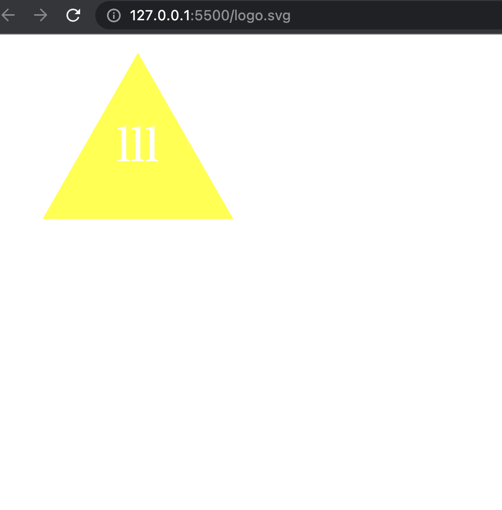

# SVG Logo Generator

## Table of Contents

- [Description of the Project](#description)
- [Installation](#installation)
- [Screenshot](#screenshot)
- [Link](#link)
- [License](#license)

## Description

This is a a Node.js command-line application that takes in user input to generate a logo and save it as an SVG file

## Installation

The users need to install inquirer to be able to use the app

## Screenshot

- Input in Command line
  

- Go to Logo.svg that is generated
  

- Open with Live Server & see the logo
  

## Link

- GitHub Repository https://github.com/Chenson92/SVG-Logo-Generator
- Video Instruction https://drive.google.com/file/d/1cRr67hfwCO5U7wwwupsE5IQvFwEzrAHM/view

## License

This project is licensed under the terms of the MIT license.
[License](https://opensource.org/licenses/MIT)
